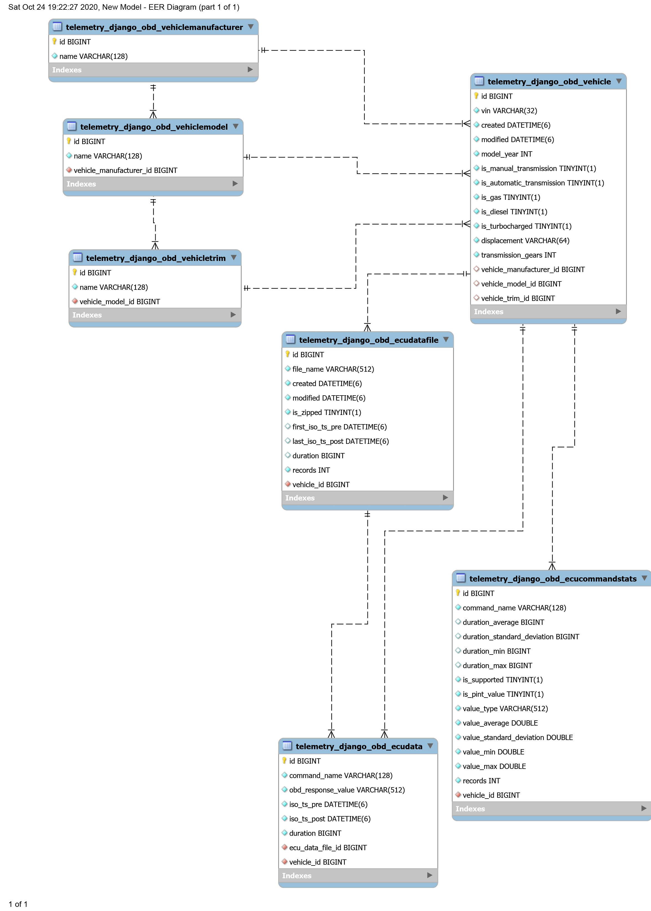

# UNDER CONSTRUCTION - Telemetry Django OBD Application

This [Django](https://www.djangoproject.com/) application contains two [Custom Management Commands](https://docs.djangoproject.com/en/3.0/howto/custom-management-commands/) to:

- Load OBD/ECU data created by telemetry-obd into a database.
- Calculates simple statistics for each OBD command by VIN and places that data into the database.

In order to be useful, a Django application requires a Django server installation in order to be useful.  [Django Project Example](https://github.com/thatlarrypearson/django-project-example) provides sample server code.  The best use of this code can be achieved when the user is familiar with the Django framework.

## ```load_obd_data_files```

The Django management program, ```load_obd_data_files```, loads data created by [Telemetry OBD Logging (telemetry-obd)](https://github.com/thatlarrypearson/telemetry-obd) into a database.

### USAGE

```python
human@linux:~/django-project-example/src$ python3.8 manage.py load_obd_data_files --help
usage: manage.py load_obd_data_files [-h] [--version] [-v {0,1,2,3}]
                                     [--settings SETTINGS] [--pythonpath PYTHONPATH]
                                     [--traceback] [--no-color] [--force-color]
                                     [--skip-checks]
                                     [file_names [file_names ...]]

Loads OBD/ECU data created by telemetry-obd

positional arguments:
  file_names            Relative or absolute file path(s).

optional arguments:
  -h, --help            show this help message and exit
  --version             show program's version number and exit
  -v {0,1,2,3}, --verbosity {0,1,2,3}
                        Verbosity level; 0=minimal output, 1=normal output,
                        2=verbose output, 3=very verbose output
  --settings SETTINGS   The Python path to a settings module, e.g.
                        "myproject.settings.main". If this isn't provided, the
                        DJANGO_SETTINGS_MODULE environment variable will be used.
  --pythonpath PYTHONPATH
                        A directory to add to the Python path, e.g.
                        "/home/djangoprojects/myproject".
  --traceback           Raise on CommandError exceptions
  --no-color            Don't colorize the command output.
  --force-color         Force colorization of the command output.
  --skip-checks         Skip system checks.
human@linux:~/django-project-example/src$ 
```

## ```ecu_command_stats.py```

Using the telemetry data in the database, this application creates and/or updates simple statistical data collected for each VIN (vehicle identification number) and OBD command pair in the database.

### USAGE

```python
human@linux:~/django-project-example/src$ python3.8 manage.py ecu_command_stats --help
usage: manage.py ecu_command_stats [-h] [--version] [-v {0,1,2,3}] [--settings SETTINGS] [--pythonpath PYTHONPATH] [--traceback]
                                   [--no-color] [--force-color] [--skip-checks]
                                   [vins [vins ...]]

Calculate simple statistics for each OBD command issued to one or more VINs.

positional arguments:
  vins                  One or more VINs. Default is all VINs.

optional arguments:
  -h, --help            show this help message and exit
  --version             show program's version number and exit
  -v {0,1,2,3}, --verbosity {0,1,2,3}
                        Verbosity level; 0=minimal output, 1=normal output, 2=verbose output, 3=very verbose output
  --settings SETTINGS   The Python path to a settings module, e.g. "myproject.settings.main". If this isn't provided, the
                        DJANGO_SETTINGS_MODULE environment variable will be used.
  --pythonpath PYTHONPATH
                        A directory to add to the Python path, e.g. "/home/djangoprojects/myproject".
  --traceback           Raise on CommandError exceptions
  --no-color            Don't colorize the command output.
  --force-color         Force colorization of the command output.
  --skip-checks         Skip system checks.
human@linux:~/django-project-example/src$ 
```

## Installation

```bash
python3.8 -m pip install pip --upgrade
python3.8 -m pip install setuptools --upgrade
python3.8 -m pip install wheel --upgrade
git clone https://github.com/thatlarrypearson/telemetry-django-obd.git
cd telemetry-django-obd
python3.8 setup.py sdist
python3.8 -m pip install .
```

## Django Server Configuration

Add ```telemetry_django_obd``` to the settings file in the Django server's ```setup.py``` as shown below.

```
INSTALLED_APPS = [
    'django.contrib.admin',
    'django.contrib.auth',
    'django.contrib.contenttypes',
    'django.contrib.sessions',
    'django.contrib.messages',
    'django.contrib.staticfiles',
    'rest_framework',

    # Django Applications
    'telemetry_django_obd',
]
```

Additionally, ```telemetry_django_obd```'s URL's need to be added to the settings file in the Django server's ```urls.py``` file as shown below.

```python
# server/urls.py
from django.contrib import admin
from django.urls import path, include
from django.views.generic import TemplateView

urlpatterns = [
    path('admin/', admin.site.urls),
    path('accounts/', include('django.contrib.auth.urls')),
    path('api-auth/', include('rest_framework.urls')),
    path('', TemplateView.as_view(template_name='index.html'), name='index'),

    # Django Applications
    path('telemetry_django_obd/', include('telemetry_django_obd.urls')),
]
```

Configure the database by running the following two commands:

```python
human@linux:~/django-project-example/src$ python3.8 manage.py makemigrations telemetry_django_obd
human@linux:~/django-project-example/src$ python3.8 manage.py migrate
```

## Database Schema

Applications table definitions are found in the ```models.py``` file.  [MySqlWorkbench](https://www.mysql.com/products/workbench/) was used to automatically generate an Entity Relationship Diagram (ERD) for the tables specific to this application.



